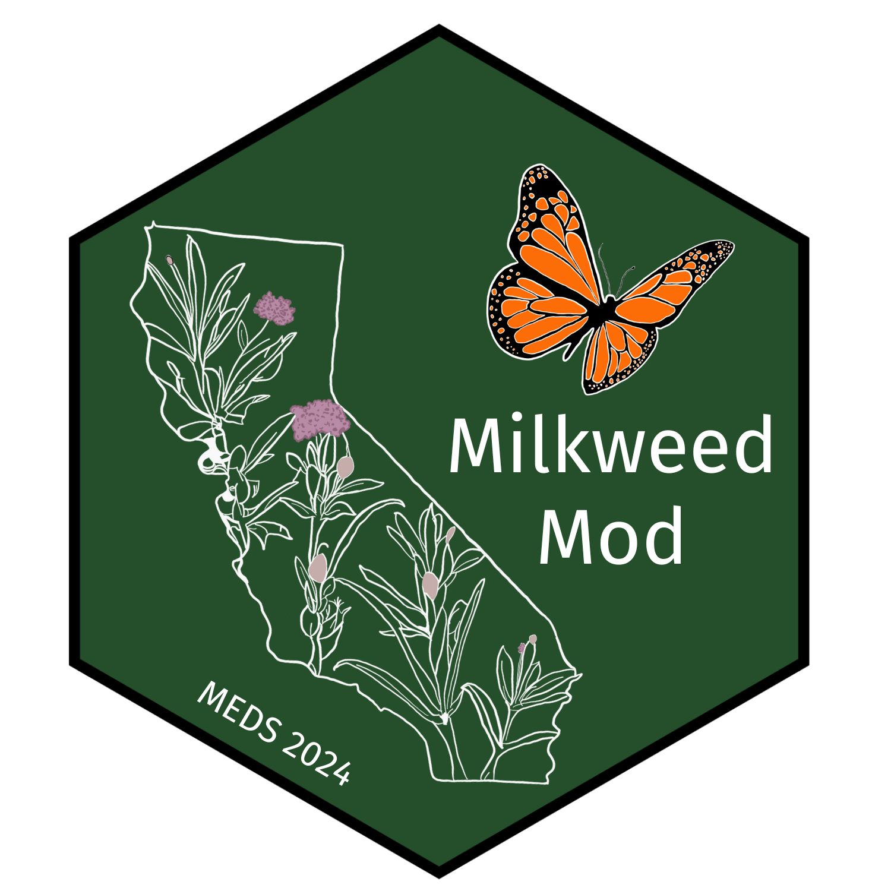

# milkweed-mod

## Project Description

The milkweed-mod repository houses the R code to process and execute code used to create products to aid the Santa Barbara Botanic Garden's milkweed survey project. The main objectives of this project are to identify high-priority milkweed survey sites, based on habitat suitability and physical accessibility, throughout the Los Padres National Forest (LPNF) to direct Santa Barbara Botanic Garden (SBBG) summer 2024 field surveys.

## Data

In order to accomplish this objective a multitude of data sources were used. In order to learn more about the data used in this project please visit this projects Technical Documentation.

## Repository Table of Contents

    ├── data_cleaning
    │   ├── accessibility_template
    │   │   └── template_raster.qmd
    │   ├── bioclim
    │   │   └── bioclim.R
    │   ├── boundary_trails
    │   │   └── lpnf_boundary_trails.qmd
    │   ├── canopy_cover
    │   │   └── canopy_cover.qmd
    │   ├── dem
    │   │   └── dem_cleaning.qmd
    │   ├── land_ownership
    │   │   └── land_ownership.qmd
    │   ├── milkweed_polygon
    │   │   ├── milkweed_subsets_points.qmd
    │   │   ├── milkweed-test.html
    │   │   ├── milkweed-test.qmd
    │   │   ├── points_clean_export.R
    │   │   ├── polygons_to_points.qmd
    │   │   └── survey_points_map.R
    │   ├── presentation_figs
    │   │   └── faculty_review.R
    │   ├── solar_rad
    │   │   └── solar_radiation.qmd
    │   └── trails_and_roads
    │       └── trails_and_roads.qmd
    ├── legends
    │   └── legned_infographic.qmd
    ├── LICENSE
    ├── maxent                                             # species distribution modeling
    │   ├── californica_bioclim_canopy_solar.qmd
    │   ├── eriocarpa_bioclim_canopy_solar.qmd
    │   ├── eriocarpa_points_bioclim_canopy_dem.qmd
    │   ├── erosa_bioclim_canopy_solar.qmd
    │   ├── milkweed_maxent.R
    │   ├── modeling_streamline.qmd
    │   ├── plot_milkweed_maxent.R
    │   ├── sdm_avg.R
    │   └── vestita_bioclim_canopy_solar.qmd
    ├── milkweed-mod.Rproj
    ├── priority_sites
    │   └── priority_sites.qmd
    ├── README.md
    ├── scripts                                        # important setup scripts found here!
    │   ├── accessibility_setup.R
    │   ├── addLegend_decreasing.R
    │   ├── crop_stack.R
    │   ├── rescale_raster.R
    │   └── setup.R
    ├── site_accessibility
    │   ├── create_accessibility_index.qmd
    │   ├── create-index-test.qmd
    │   ├── distance_calculations.qmd
    │   ├── rescale_all_layers.qmd
    │   └── rescale_canopy_cover.qmd
    └── walkthroughs                                 # walkthroughs for updates found here!
        └── updating_milkweed-mod.qmd
